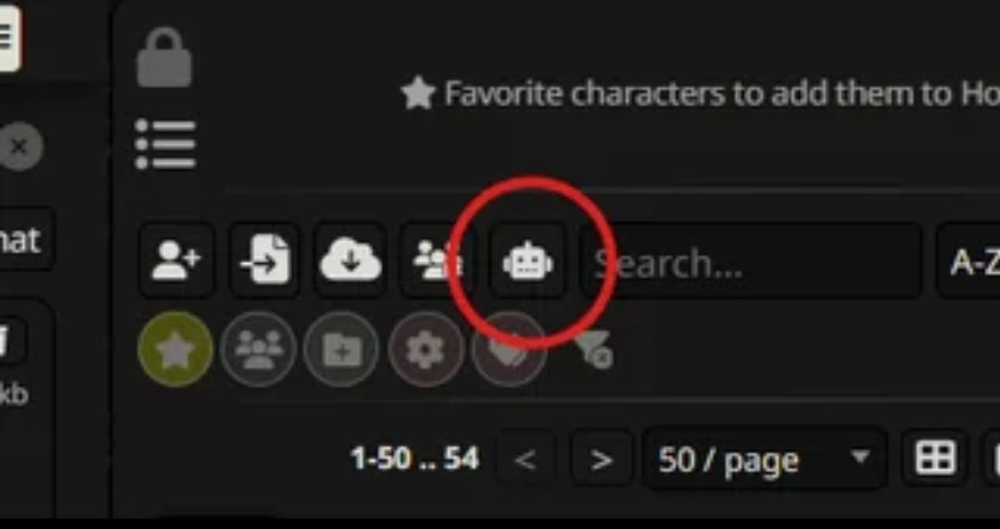

# Bot Browser

Browse bots, lorebooks, collections, trends, and your own local SillyTavern library from one place.

## Installation

Install via the SillyTavern extension installer:

```
https://github.com/mia13165/SillyTavern-BotBrowser
```

## How to Use

Click the bot icon next to the import bots button.



Bot Browser now opens in standalone mode by default.

- Use `Hide` if you want to tuck it out of the way without losing your place
- Use `Classic UI` if you want to go back to the older layout
- Use `Back to SillyTavern` if you want to close the standalone view


Browse cards, open the details, and import them into SillyTavern if you want them.

## Tabs

- **Bots** - Main source browser, Search All, AI Finder, and your local character library
- **Lorebooks** - Live lorebook sources plus your local World Info files
- **Trending** - Trending feeds from supported sources
- **Collections** - Collection pages from supported sites
- **Personal** - My Characters, favorites, personal feeds, and followed creators
- **Bookmarks** - Saved cards and lorebooks


## Main Features

- **Standalone UI** - Full standalone browser inside SillyTavern
- **Search All** - Search across the main live bot sources in one place
- **AI Finder** - Separate multi-turn AI search window with saved chats
- **Detailed Card Modal** - Better details, gallery, creator notes, website summary, metadata, and import analysis
- **Import / Update** - Import as new or update an existing local character when there is a likely match
- **Bookmarks** - Save cards and lorebooks for later
- **Favorite Creators** - Follow creators and get update pings when they post again
- **Collections** - Browse and open collection pages directly
- **Trending** - Separate trending feeds instead of burying them in normal browse
- **Notifications** - Small in-app notifications for imports, bookmarks, follows, and similar actions
- **Help Panel** - Search tips, AI tips, and shortcuts
- **Update Banner** - Lets users know when a newer Bot Browser version exists
- **Mobile Support** - Standalone mode, filters, modal layouts, and local editors work much better on mobile now


## Search

You can search normally, or use filters when a source supports them.

- **Search All** is for when you do not care which source the bot comes from
- Use `+tag` to force a tag in
- Use `-tag` to force a tag out
- Use source-specific filters when the source supports them
- Toggle which live sources Search All is allowed to use
- Hide NSFW, blur NSFW, blur all cards, or hide locked-definition cards


## AI Finder

AI Finder is a separate full chat window. It is not just a Search All popup.

It can:

- search live sources for you
- keep going over multiple turns
- save chats locally so you can reopen them later
- reference `My Characters`
- reference connected personal feeds and followed creators
- return cards you can open directly

Some models are better than others here. Bot Browser handles the search loop, retries, and parsing extension-side so it works with more profiles.


## Local Library

Bot Browser also works with your own SillyTavern content.

### My Characters

- search your local characters
- sort and filter them
- bookmark them
- open a dedicated local character modal
- inspect the real character fields instead of a thin import view
- edit the card
- jump straight into the SillyTavern chat
- use built-in AI tools to help write or rewrite fields

### Your Lorebooks

- search your local World Info files
- sort and filter them
- bookmark them
- open a dedicated lorebook editor modal
- inspect and edit entries
- add or remove entries
- use built-in AI tools to help draft or expand lorebook content


## Personal Features

- **My Characters**
- **Chub Timeline**
- **Chub Favorites**
- **Sakura Favorites**
- **Harpy For You**
- **CrushOn Likes**
- **Favorite Creators**

Some personal feeds need auth. Bot Browser has a `Connections` section in Settings for tokens, cookies, and source-specific instructions.


## Source Types

### Best Live Sources

- Chub
- JannyAI
- Character Tavern
- CAIBotList
- Sakura.fm
- Wyvern
- CharaVault

### More Live Sources

- Harpy.chat
- RisuRealm
- Backyard.ai
- CrushOn.AI
- Botify.ai
- Joyland.ai
- SpicyChat
- Talkie AI
- Saucepan.ai
- 4chan `/aicg/`
- MLPchag
- Pygmalion
- Character Archive (bring your own hosted frontend URL)

### Lorebook Sources

- Chub Lorebooks
- Chub Lorebooks Archive
- Wyvern Lorebooks
- Saucepan Lorebooks

### Trending Sources

- Chub
- Character Tavern
- Wyvern
- Backyard.ai
- JannyAI
- CAIBotList
- RisuRealm

### Archive Snapshots

- Chub Archive
- RisuRealm Archive
- Catbox
- 4chan `/aicg/` archive
- Desuarchive
- Webring
- Nyai.me

## Settings

Bot Browser now has a much bigger settings surface than before.

- **Connections** for auth-required sources
- **Search** defaults for Search All and randomization
- **Safety** for NSFW handling
- **Display** options
- **Anti-Slop** quality filtering
- **Import / export settings** so users can move settings between devices


## Notes

- Some sources expose full card data and import very cleanly
- Some sources only expose public summaries or partial definitions
- Some features need auth, depending on the source
- Archive sources are useful backups, but they are not full mirrors of the live platforms
- Sites change their APIs sometimes, so a source can break until Bot Browser is updated
